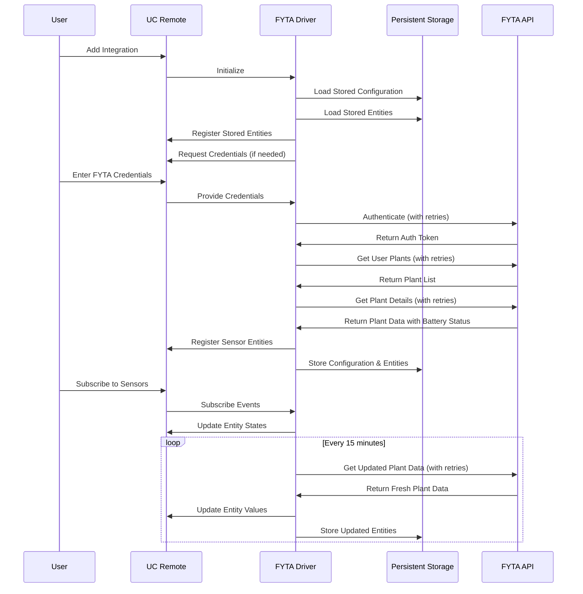
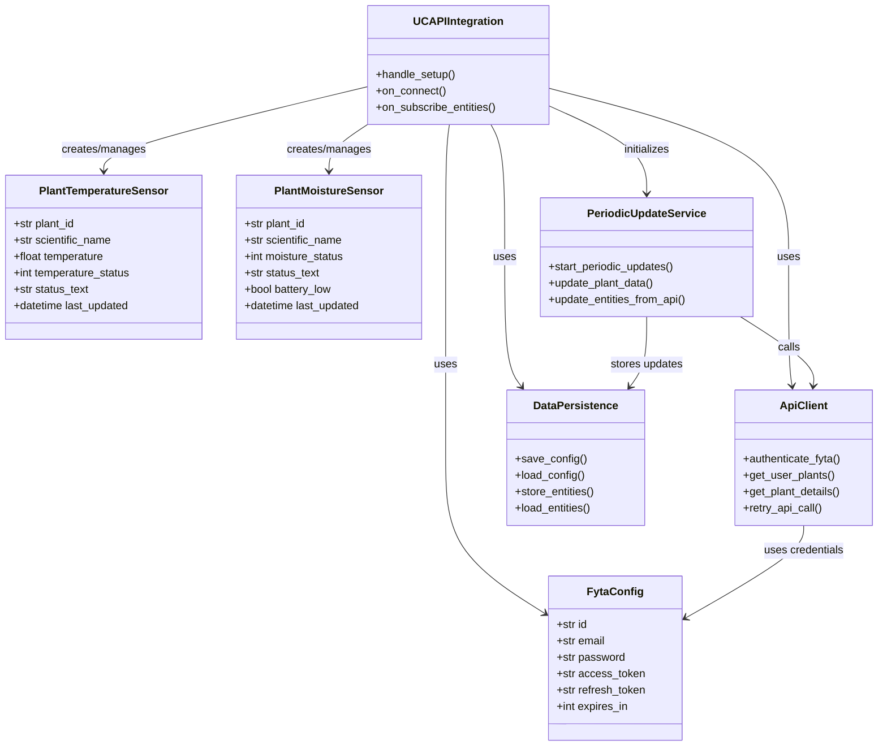

# FYTA Plant Monitor Integration for UC Remote

This integration connects FYTA plant sensors to Unfolded Circle's Remote Two, allowing you to monitor your plants' temperature and moisture status directly from your UC Remote interface.

**Current Status: Beta** - Stable version with reliable plant monitoring functionality.

## Screenshots

<div style="display: flex; flex-wrap: wrap; gap: 20px; justify-content: center;">
  
  
</div>

▶️ [Watch the installation and configuration video](https://youtu.be/pRwuLrct8fc)

## Features

- Authenticate with FYTA API
- Retrieve plant data for plants with sensors
- Display temperature readings with °C units
- Display moisture status as human-readable text (Perfect, Too Low, etc.)
- Low battery warnings displayed alongside moisture status
- Configuration through UC Remote interface
- Automatic periodic updates every 15 minutes
- Robust error handling with automatic retries for API timeouts
- Persistent storage of entity data that survives reboots

## Data Flow



## Setup Instructions

### Prerequisites

- UC Remote
- FYTA account with plant sensors (you can also use the default plant called Günther for testing)
- Docker (for compiling)

### Quick Start Guide

To install the pre-compiled integration:

1. Enable Web Configurator and connect to it
2. In General settings, enable Beta Updates and restart
3. Install beta firmware 2.3.0
4. Upload `uc-fyta-custom-aarch64.tar.gz` in Integrations
5. Configure FYTA credentials and select plant sensors

### Installation

1. Compile the integration (see Compilation Instructions)
2. Add the integration to your UC Remote
3. Follow the setup process and enter your FYTA credentials
4. Select the plant sensors you want to monitor

## Compilation Instructions

The integration can be compiled using Docker:

```bash
# Clone the repository
git clone https://github.com/yourusername/uc-fyta-integration.git
cd uc-fyta-integration

# Run the compilation script
chmod +x docker-compile.sh
./docker-compile.sh
```

This will create a `uc-fyta-custom-aarch64.tar.gz` file that can be installed on UC Remote.

## Architecture

### Component Architecture



## How to Contribute

Contributions are welcome! Here are some ways you can help improve this integration:

1. **Code Improvements**:
   - Improve UI for data visualization

2. **Testing**:
   - Report bugs and issues

3. **Documentation**:
   - Improve this README

## License

This project is licensed under the MIT License - see the LICENSE file for details.

## Acknowledgments

- FYTA for their plant monitoring technology
- Unfolded Circle Community for the support
