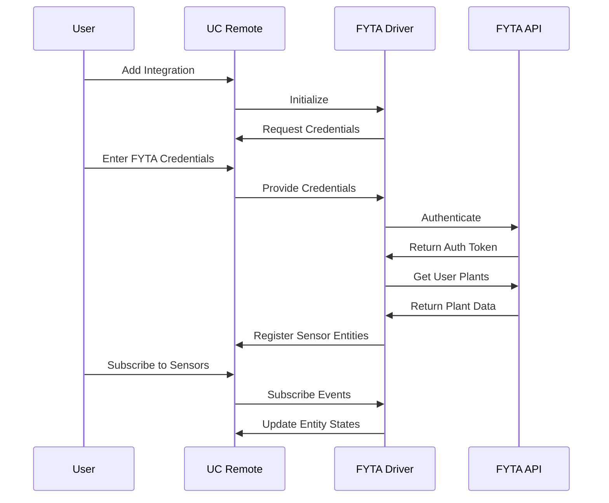
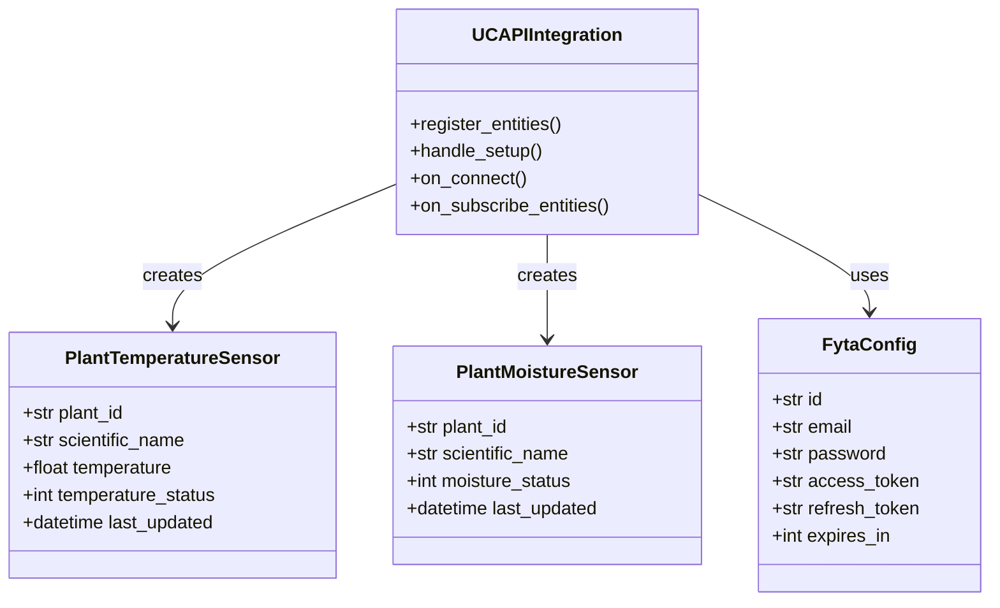

# FYTA Plant Monitor Integration for UC Remote


This integration connects FYTA plant sensors to Unfolded Circle's Remote Two, allowing you to monitor your plants' temperature and moisture status directly from your UC Remote interface.

**Current Status: MVP/Alpha** - Early development version with basic plant monitoring functionality.

## Screenshots

<div style="display: flex; flex-wrap: wrap; gap: 20px; justify-content: center;">
  
  
</div>

## Features

- Authenticate with FYTA API
- Retrieve plant data for plants with sensors
- Display temperature readings with °C units
- Display moisture status as human-readable text (Perfect, Too Low, etc.)
- Configuration through UC Remote interface

## Data Flow



## Setup Instructions

### Prerequisites

- UC Remote
- FYTA account with plant sensors (you can also use the default plant called Günther for testing)
- Docker (for compiling)

### Quick Start Guide

To install the pre-compiled integration:

1. Enable Web Configurator and connect to it
2. In General settings, enable Beta Updates and restart
3. Install beta firmware 2.3.0
4. Upload `uc-fyta-custom-aarch64.tar.gz` in Integrations
5. Configure FYTA credentials and select plant sensors

### Installation

1. Compile the integration (see Compilation Instructions)
2. Add the integration to your UC Remote
3. Follow the setup process and enter your FYTA credentials
4. Select the plant sensors you want to monitor

## Compilation Instructions

The integration can be compiled using Docker:

```bash
# Clone the repository
git clone https://github.com/yourusername/uc-fyta-integration.git
cd uc-fyta-integration

# Run the compilation script
chmod +x docker-compile.sh
./docker-compile.sh
```

This will create a `uc-fyta-custom-aarch64.tar.gz` file that can be installed on UC Remote.

## Architecture

### Component Architecture



## Known Issues and Limitations

### Bugs

- **UI Freeze**: Sometimes the frontend freezes when adding the selected entities during the integration setup phase. Workaround: Kill the page and refresh it, then the integration works correctly.

### Limitations

- **No periodic updates**: Currently, the integration only retrieves plant data during the initial setup. There is no periodic polling to update the sensor data. The entities show the data that is queried and received from the FYTA API at setup time.
- **Reboot Issues**: After rebooting the UC Remote, the entities may not load correctly on the screen. A reinstallation of the integration is required to restore proper functionality.
- Error handling is minimal

## How to Contribute

Contributions are welcome! Here are some ways you can help improve this integration:

1. **Code Improvements**:

   - Add periodic data updates
   - Improve error handling
   - Build a custom UI for data visualization

2. **Testing**:

   - Report bugs and issues

3. **Documentation**:
   - Improve this README
   - Add screenshots

## License

This project is licensed under the MIT License - see the LICENSE file for details.

## Acknowledgments

- FYTA for their plant monitoring technology
- Unfolded Circle for the UC Remote platform and API
